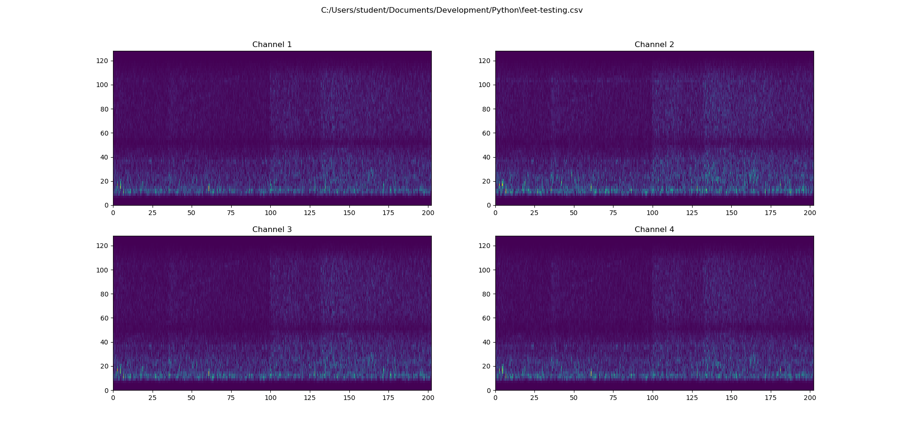

# Short-Time-Fourier-Transform-Visualization-GUI
A simple tool for visualizing the short-time Fourier transform using Python.
## Example Usage
The user selects a directory containing CSV files for analysis. All the CSV files found in the directory are displayed in a listbox. The user can then select the file or files they wish to analyze.

CSV files should be organized such that rows correspond to channels and columns correspond to time. Currently other time-series data formats, like EDF and GDF, are not supported because ~~they are garbage~~, while these data formats are prevalent in the field biosignal analysis, there is not wide-spread support for these data types, and many are primarily used for specific use-cases. CSV, on the other hand, is easy to use and allows any type of multichannel time-series to be visualized.

From the GUI users can select a pseudocolor and/or a 3d plot to represent the data. 

The same data as a 3d plot.

The user can select an arbitrary number of channels to display. Below is the first 8 channels from a 22 channel EEG dataset.

## Dependancies 
numpy v 1.16.2 or higher

matplotlib v 3.1.3 or higher

pandas v 0.24.2 or higher

scipy v 1.2.1 or higher

mne v 0.19.2 or higher
